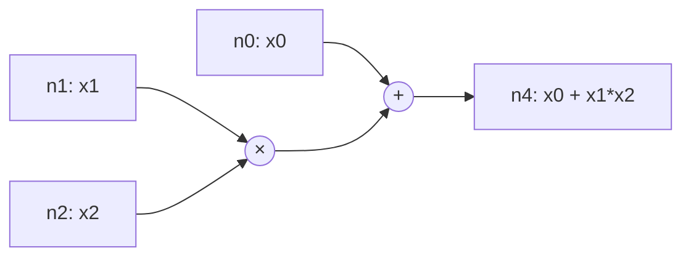
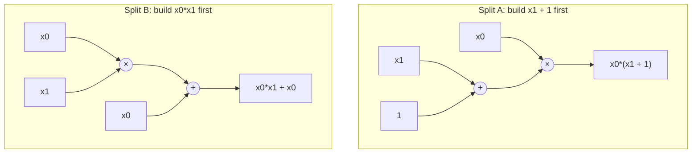

# Polynomial Arithmetic Circuits RL

This repository explores learning to build arithmetic circuits that exactly match target polynomials.

## Project Goal

Given a target polynomial over variables `x0..x{n-1}`, learn a policy that constructs it using a short sequence of:
- `add(node_i, node_j)`
- `multiply(node_i, node_j)`

The long-term objective is to improve exact-match success on harder polynomial targets (higher complexity) while keeping circuits compact.

## Theory: Split-Point-Built Circuits

In the scripts here, a circuit is built one node at a time from the base set

\[
\mathcal L_0 = \{x_0,\dots,x_{n-1},1\}.
\]

At each later step, the code combines a newly reached node with any previously seen node using either addition or multiplication, then canonicalizes the result with SymPy expansion:

\[
\mathcal L_{t+1} =
\left\{
\operatorname{canon}(u+v),\ \operatorname{canon}(uv)
\;:\;
u\in\mathcal L_t,\;
v\in\bigcup_{i=0}^{t}\mathcal L_i
\right\}
\setminus
\bigcup_{i=0}^{t}\mathcal L_i.
\]

This is the layered game-board construction implemented in:
- `src/environment/build_game_board.py` for the single-variable board
- `Game-Board-Generation/interesting_polynomial_generator.py` for the multi-variable board and path analysis

We can view the final gate of a circuit as a **split point**. For a target polynomial `f`, a split point is a choice of operator and predecessors

\[
f = g + h \quad\text{or}\quad f = gh
\]

where `g` and `h` are themselves already buildable by smaller subcircuits. In the graph files, that split information is stored on edges via `(source, operand, op)`. A polynomial can have:

- a **unique shortest split point**, giving one obvious minimal circuit, or
- **multiple shortest split points**, giving several equally short circuits for the same target.

That second case is exactly what `interesting_polynomial_generator.py` measures with `shortest_path_count`, `multiple_shortest_paths`, and `shortest_path_samples`.

### Worked Example 1: a unique shortest split point

Take

\[
f(x_0,x_1,x_2)=x_0+x_1x_2.
\]

The natural top-level split is additive:

\[
f = x_0 + (x_1x_2).
\]

So a shortest circuit uses two operations:

| Step | New node | Operation |
| --- | --- | --- |
| 0 | `n0 = x0` | input |
| 0 | `n1 = x1` | input |
| 0 | `n2 = x2` | input |
| 1 | `n3 = x1*x2` | `multiply(n1, n2)` |
| 2 | `n4 = x0 + x1*x2` | `add(n0, n3)` |



### Worked Example 2: two shortest split points

Now consider

\[
f(x_0,x_1)=x_0x_1+x_0 = x_0(x_1+1).
\]

This target has two equally short length-2 circuits because the last gate can split the polynomial in two different ways:

\[
f = (x_0x_1) + x_0
\qquad\text{or}\qquad
f = x_0(x_1+1).
\]

So the game board contains two shortest predecessor chains to the same target node.

| Circuit | Step 1 | Step 2 |
| --- | --- | --- |
| A | `n3 = x1 + 1` | `n4 = x0 * n3` |
| B | `n3 = x0 * x1` | `n4 = n3 + x0` |



In other words, split-point-built circuits are the combinatorial objects that the repo searches over: each path through the board corresponds to a legal recursive factorization/addition plan, and multi-path targets are precisely the ones with several valid minimal plans.

## What Is Implemented

### 1. PPO + Supervised Pretraining + Optional MCTS
- Main file: `src/PPO RL/PPO.py`
- Environment: `src/PPO RL/State.py`
- Planner: `src/PPO RL/mcts.py`
- Model: GNN encoder + Transformer decoder + policy/value heads
- Training flow:
1. Build supervised `(state -> next_action)` dataset
2. Train supervised checkpoint
3. Continue with PPO fine-tuning (curriculum + optional MCTS guidance)

### 2. SAC (Discrete) + Optional MCTS Distillation
- Main file: `src/SAC RL/SAC.py`
- Includes replay buffer, twin Q heads, target network, synthetic prefill, and curriculum logic
- Supports training target modes (`random`, `pool`, `mixed`, `dataset`) via config

### 3. Transformer Polynomial->Circuit Translation Pipeline
- Package: `transformer/`
- End-to-end driver: `transformer/pipeline.py`
- Steps implemented:
1. Generate board data (`nodes/edges/analysis` JSONL)
2. Build polynomial->circuit examples
3. Train seq2seq transformer
4. Evaluate (seen + unseen) and run inference

### 4. Game-Board / Interesting Polynomial Generation
- Main generator: `Game-Board-Generation/interesting_polynomial_generator.py`
- Wrapper for analysis compatibility: `Game-Board-Generation/pre-training-data/analyze_paths.py`
- Produces GraphML, JSON, JSONL, and path-multiplicity analysis.

### 5. Visualization
- Streamlit demo: `demo_visualizer.py`
- Reusable rendering utilities: `visualization/circuit_visualizer.py`

### 6. Tests
- Generator tests: `tests/generator_tests/`
- Visualizer tests: `tests/test_visualizer.py`

## Implemented Objective Equations

### PPO + MCTS (as implemented)

Action collection mixes planner guidance with policy sampling:

\[
a_t =
\begin{cases}
a_t^{\text{MCTS}}, & z_t = 1 \\
a_t^{\pi}, & z_t = 0
\end{cases},
\quad
z_t \sim \text{Bernoulli}(p_{\text{mix}})
\]

where `p_mix = mcts_policy_mix` in `src/PPO RL/PPO.py`.

GAE used in updates:

\[
\delta_t = r_t + \gamma V(s_{t+1}) - V(s_t),\qquad
\hat A_t = \delta_t + \gamma\lambda \hat A_{t+1}
\]

PPO minibatch loss:

\[
r_t(\theta) = \exp\left(\log \pi_\theta(a_t|s_t)-\log \pi_{\theta_{\text{old}}}(a_t|s_t)\right)
\]
\[
\mathcal L_{\text{PPO}}(\theta)=
-\mathbb E\!\left[\min\!\left(r_t(\theta)\hat A_t,\ \text{clip}(r_t(\theta),1-\epsilon,1+\epsilon)\hat A_t\right)\right]
+ c_v\,\text{MSE}(V_\theta(s_t),\hat R_t)
- c_e\,\mathbb E[\mathcal H(\pi_\theta(\cdot|s_t))]
\]

This matches:
- clipped surrogate + value MSE + entropy regularization in `train_ppo`
- `\epsilon = ppo_clip`, `c_v = vf_coef`, `c_e = ent_coef`.

### Discrete SAC + MCTS Distillation Term (as implemented)

Masked soft value target:

\[
V_{\bar\theta}(s')=\sum_{a\in\mathcal A_{\text{valid}}(s')}
\pi_\theta(a|s')\left(\min_i Q_{\bar\theta,i}(s',a)-\alpha\log\pi_\theta(a|s')\right)
\]
\[
y_t = r_t + \gamma(1-d_t)\,V_{\bar\theta}(s_{t+1})
\]

Twin-Q loss:

\[
\mathcal L_Q=\text{MSE}(Q_{\theta,1}(s_t,a_t),y_t)+\text{MSE}(Q_{\theta,2}(s_t,a_t),y_t)
\]

Policy loss (discrete expectation over valid actions):

\[
\mathcal L_\pi =
\mathbb E_{s_t}\left[\sum_{a\in\mathcal A_{\text{valid}}(s_t)}
\pi_\theta(a|s_t)\left(\alpha\log\pi_\theta(a|s_t)-\min_i Q_{\theta,i}(s_t,a)\right)\right]
\]

Optional MCTS policy cross-entropy regularizer (only when MCTS distribution is available):

\[
\mathcal L_{\text{CE}} = -\mathbb E_{s_t}\!\left[\sum_{a}\pi^{\text{MCTS}}(a|s_t)\log\pi_\theta(a|s_t)\right]
\]
\[
\mathcal L_{\text{SAC-total}} = \mathcal L_Q + \mathcal L_\pi + \lambda_{\text{mcts}}\mathcal L_{\text{CE}}
\]

with `\lambda_mcts = mcts_ce_coef` in `src/SAC RL/SAC.py`.

### Transformer (polynomial -> circuit) training objective

For source token sequence \(x_{1:n}\) and target sequence \(y_{1:m}\), training uses teacher forcing and next-token prediction:

\[
\mathcal L_{\text{TF}}(\theta)=
-\sum_{t=1}^{m-1}\log p_\theta\!\left(y_{t+1}\mid y_{1:t},x_{1:n}\right)
\]

implemented as token-level cross-entropy with padding ignored:

\[
\mathcal L_{\text{TF}}=\text{CrossEntropy}(\text{logits}, y_{\text{out}};\ \text{ignore\_index}=\text{pad\_id})
\]

This corresponds to `tgt_in`/`tgt_out` shifting and `nn.CrossEntropyLoss(ignore_index=pad_id)` in `transformer/train.py`.

## Current Artifacts In Repo

- PPO evaluation sample: `evaluation_results_C6.json`
  - Config: `n_variables=3`, `max_complexity=6`
  - Summary in file: `1/10` exact successes (`10%`)
- SAC run report: `sac_v4_report.md`
  - Includes logged run statistics and plotted metrics (`sac_v4_live_smooth.png`)
- Saved model checkpoints (examples):
  - `ppo_model_n3_C6_curriculum.pt`
  - `sac_model_n3_C8.pt`
  - `transformer_checkpoints/board_C4.pt`

## Environment Setup

```bash
python3 -m venv .venv
source .venv/bin/activate
pip install -r requirements.txt
```

Core dependencies in `requirements.txt`:
- `torch`
- `torch_geometric`
- `sympy`
- `numpy`
- `tqdm`
- `streamlit`
- `pyvis`

## How To Run

### Streamlit Circuit Demo

```bash
streamlit run demo_visualizer.py
```

### PPO Training

```bash
python "src/PPO RL/PPO.py"
```

### SAC Training

```bash
python "src/SAC RL/SAC.py"
```

### PPO Evaluation Script

```bash
python evaluate_ppo_model.py
```

Important: `evaluate_ppo_model.py` currently contains a hardcoded `model_path`. Update that path to your local checkpoint if needed.

### Transformer End-to-End Pipeline

```bash
python -m transformer.pipeline \
  --steps 4 \
  --num-vars 1 \
  --checkpoint transformer_checkpoints/board_C4.pt
```

### Generate Board Data Only

```bash
python -m transformer.build_training_data \
  --steps 4 \
  --num-vars 1 \
  --output-dir transformer/boards \
  --prefix game_board_C4_V1
```

### Run Tests

```bash
pytest tests
```

## Repository Notes

- `Older Work/` and `opentensor12-01/` are retained for earlier experiments/reference.
- Active development paths are primarily `src/`, `transformer/`, `Game-Board-Generation/`, `visualization/`, and `tests/`.
