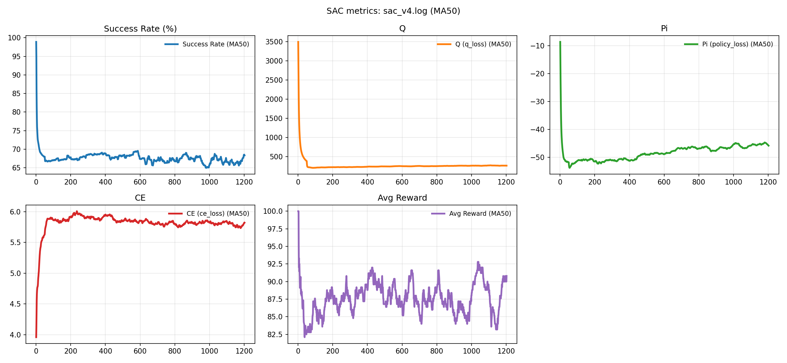

# SAC v4 Training Report

**Run Snapshot**
Device: cuda (from log)
Compact encoder size: 912
Prefilled replay buffer: 7,526 synthetic steps (from log)

**Overall Training**
Iterations: 1202 (Iter 1 → 1202)
Final iteration metrics (Iter 1202): SR 72.4%, Q 261.2686, Pi -46.2118, CE 5.7395, Buffer 200000

**Success Rate (SR) Summary**
Mean: 67.50% | Median: 69.0% | Std: 4.96
Min: 50.3% at Iter 773 | Max: 98.9% at Iter 1
First 50 iters mean SR: 67.98% (Iters 1–50)
Last 50 iters mean SR: 68.30% (Iters 1153–1202)
Last 100 iters mean SR: 67.31% (Iters 1103–1202)

**Loss Metrics (from `src/SAC RL/SAC.py`: Q = `q_loss`, Pi = `policy_loss`, CE = `ce_loss`)**
Q loss mean: 253.12 (median 248.66); min 179.0424 at Iter 55, max 3494.4610 at Iter 1
Pi loss mean: -48.41 (median -48.04); min -60.1394 at Iter 124, max -8.5898 at Iter 1
CE loss mean: 5.836 (median 5.829); min 3.9601 at Iter 1, max 6.6328 at Iter 124
Note: Q loss mean is skewed by Iter 1 (very large value). After Iter 50, Q mean is ~247.37.

**Complexity Schedule**
Complexity was auto-adjusted based on recent SR thresholds. Iter 1 started at complexity 2, moved to 3 at Iter 2, and then toggled between 3 and 4 thereafter.
Time spent and SR by complexity:
C=2: 1 iters (0.1%), SR mean 98.90% (min 98.9%, max 98.9%)
C=3: 1019 iters (84.8%), SR mean 68.26% (min 50.3%, max 90.6%)
C=4: 182 iters (15.1%), SR mean 63.05% (min 52.9%, max 74.1%)

**Sampled Example Outcomes (5 examples per iteration)**
Examples logged: 6010 | Successes: 5268 | Failures: 742
Example success rate: 87.65%
Reward stats: mean 87.65, median 100.00, min -0.72, max 100.00
Steps stats: mean 6.82, median 6.0, min 5, max 12

**Replay Buffer & Checkpoints**
Buffer size: 11622 at Iter 1 → 200000 by Iter 47, then capped at 200,000
Checkpoints saved every 50 iters: 24 saves (Iter 50..1200) to `sac_model_v4_n3_C8.pt`

**Plot**
Generated with `scripts/plot_sac_log_live.py` using `sac_v4.log`.
Full-run view (all iterations) with a moving average window of 50 to show convergence trends.

